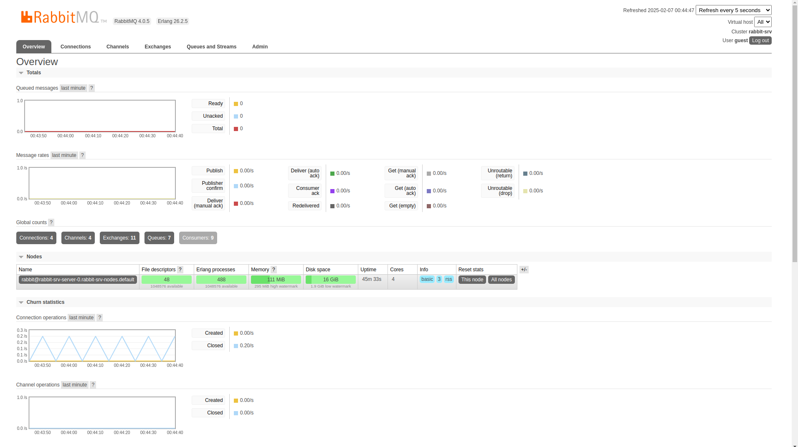

# Event-Driven Scalable Microservices Ticket System

# Features:
##### - Auth microservice;
##### - Ticket microservice;
##### - Order microservice;
##### - Expiration microservice (Redis & Bull to expire an order if time limit is reached);
##### - Payments microservice (with Stripe);

# Technologies:
#### - Kubernetes, Docker, Ingress, Rabbitmq Cluster Operator, Nodejs, Typescript, Mongodb, Express, Redis, Bull, Stripe, Amqplib, common NPM package @eftickets/common, Json Web Token, Cookie, Design patterns, CRUD & validation, Authentication, Authorization, Skaffold.

